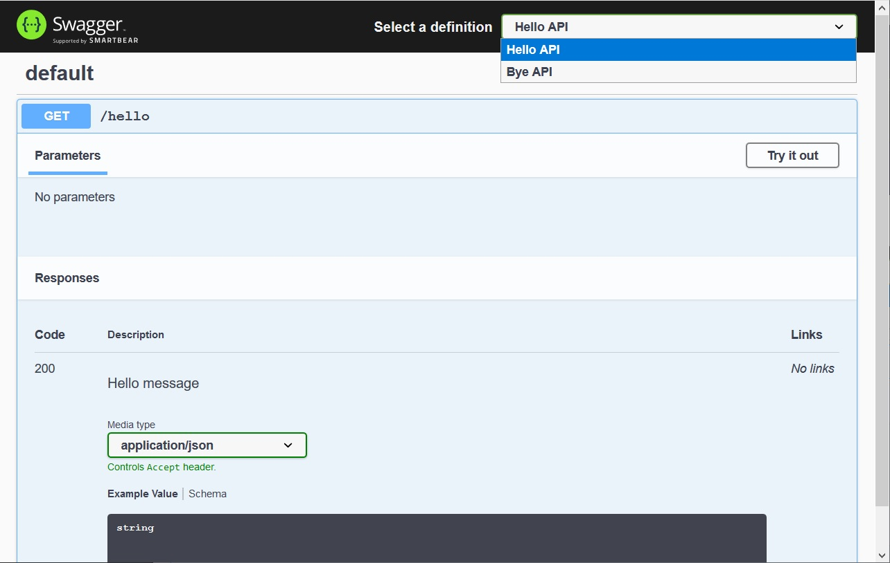

# Swagger example 3

This sample will start Jetty embedded on port 8080.

There are 2 different endpoints defined in separate servlets, each with its own swagger file available at:

- [http://localhost:8080/api-docs/bye/openapi.json](http://localhost:8080/api-docs/bye/openapi.json)
- [http://localhost:8080/api-docs/hello/openapi.json](http://localhost:8080/api-docs/hello/openapi.json)

**Swagger UI:**
[http://localhost:8080/ui/](http://localhost:8080/ui/)

